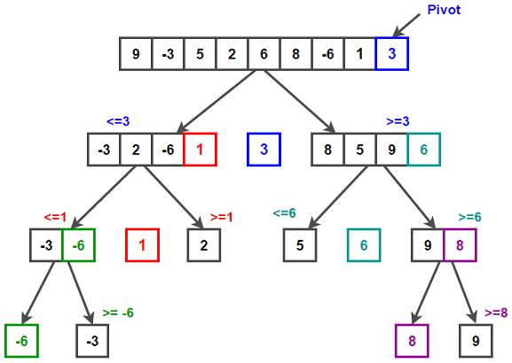

# Quick sort

- Like merge sort, exploits the fact that arrays of 0 or 1 element are always sorted. 

`[]` - nothing to sort;

`[2]`-only one element, therefore it's already sorted;

- Works by selecting one element (called the "pivot") and finding the index where the pivot should end up in the sorted array.

Quick sort selects an element either from the leftmost or rightmost of the list to act as a **pivot**. The elements **smaller** than the pivot are ordered on the **leftmost** and the **greater** ones at the **rightmost**. This process is repeated for each sub-list using recursion.
       
There are various ways of choosing the pivot, namely:

* Choosing the **first** element
* Choosing the **last** element
* Pick an element randomly

Example for pivot as last element:

Example for pivot as first element:

[Visualgo](https://visualgo.net/en/sorting)

### Implementation:

- **Partition** helper method
- Call `quickSort()` recursively on the subarrays

### Part 1: Partition(pivot) Helper
- In order to implement quicksort, it's useful to first implement a function responsible for arranging elements in an array on either side of a pivot
- Given an array, this helper function should designate an element as the pivot.
- It should then rearrange elements in the array so that all values less than the pivot are moved to the left of the pivot, and all vlaues greater than the pivot moved to the right of the pivot.
- The order of elements on either side of the pivot doesn't matter!
- The helper should do this in place, that is, it should not create a new array.
- When complete, the helper should return the **index of the pivot**

### Pseudocode 
Write a function `partition()` that accepts 3 arguments: an array, start index, and an end index( default values: start = 0, end = array.length-1);

* Grab the pivot from the start of the array 
* Store the current pivot index in a variable `swapIndex`(this will keep track of where the pivot should end up).
* Loop through the array from start to end
  * If the pivot is greater than the current element, increment the pivot index variable and then **swap** the current element with the element in the pivot index
* Outside of the loop swap the starting element(i.e the pivot) with the pivot index.
* Return the `swapIndex`.

### Part 2: quickSort()
Write a function `quickSort()` that accepts 3 arguments: an array, start index, and an end index( default values: start = 0, end = array.length-1);

* Call the partition helper on the array that's been passed in
* When the helper returns the updated pivot index, **recursively** call `quickSort()` on the left and on the right subarray

## Picking a pivot 

### The runtime of quick sort depends in part on how one selects the pivot
- Ideally, the pivot should be chosen so that it's roughly the median value in the data set you're sorting
- For simplicity, we'll always choose the pivot to be the first element or the last.

**Best case**

If we assume perfect partitioning, we get exact halves every time. The "halves" probably won't be precisely equal, but if we choose the pivot well, they should be pretty close.

In this case, the number of times we can break it in half will be the base-2 logarithm of the number of inputs. For example, given 128 inputs, we get partition sizes of 64, 32, 16, 8, 4, 2, and 1. That's 7 levels of partitioning (and yes log2(128) = 7).

So, we have O(logN) partitioning "levels", or height of the stack frames and each level has to visit all N inputs. So, log(N) levels times N operations per level gives us **O(N log N)** overall complexity.
In the best case scenario, the entire algorithm will take O(N) * O(logN) which is equal to **O(N log N)**

**Worst case**

The worst case is if we pick a pivot that's actually the smallest or largest element in the input. In this case, we do an O(N) partitioning level, but instead of getting two halves of equal size, we've ended up with one partition of one element, and one partition of N elements. If that happens for every level of partitioning, we obviously end up doing O(N),instead of O(logn) partitioning levels before even partition is down to one element.

This gives the technically correct big-O complexity for Quicksort. Since we have O(N) levels of partitioning, and each level requires O(N) steps, we end up with O(N * N) (i.e., **O(N2)** complexity. 